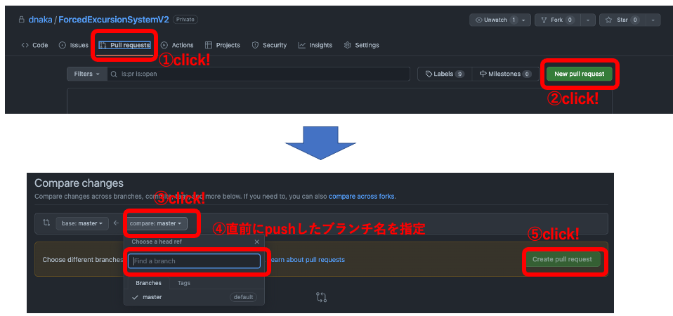
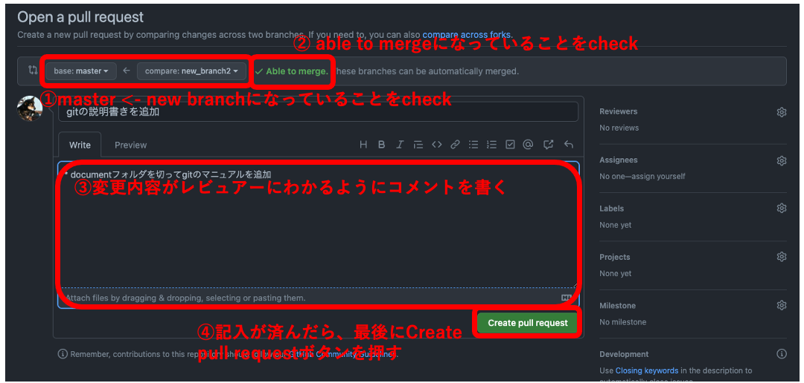
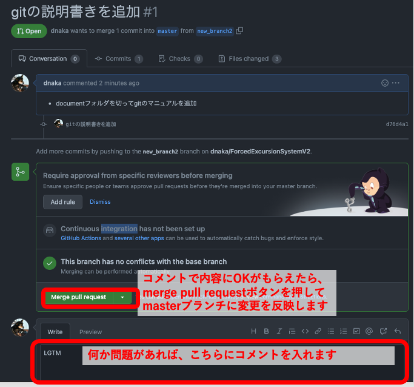

# git のシーケンス

基本的なコマンドなどの説明は <https://backlog.com/ja/git-tutorial/> に全て載っています。

作業を行う場合は、上記を確認した上で、次の手順で行ってください。

## 1.まず clone する

```sh
# コマンドなどでローカルPC上にソースファイルをコピーします
# SSHの制限などでエラーになる場合があります。その場合は質問してください。
git clone https://github.com/dnaka/ForcedExcursionSystemV2.git
```

## 2.チケット作業を始める前に、ローカル PC 上の master ブランチをクラウド上の master ブランチと同期する

```sh
# masterブランチに一度切り替えます（既にmasterブランチの場合は不要です）
git checkout master

# クラウド上のリポジトリの最新ログをチェックします
git fetch origin

# クラウド上のmasterブランチの内容をローカルPC上のカレントブランチに反映します(もしカレントブランチがmasterでない場合は、そのブランチに差分が上書きされます)
git merge origin/master
```

## 3. ローカル PC 上の最新の master ブランチから、チケット用の作業ブランチを分岐させる

```sh
# [ticket name]で指定された文字列の名前で、masterから分岐したブランチが作成されます
git checkout -b [ticket_name]
```

### 4. ソースコードを変更します。

普通に Visual Studio Code 上などでコーディングを実施します。
ある程度動作する（最低限、動かしてもすぐエラーにならない）程度には作り込んでください

### 5. 区切りのいいところまで完成したら、コミットしてローカル PC 上での変更を確定させます

```sh
# 変更したファイルを、gitの管理下におきます（addは指定ファイルをgitの管理下に置くコマンドです)
# 変更したファイルが複数ある場合は、addコマンドを複数回実行するか、ワイルドカード(*)が使えます
git add [changed file path]

# commitコマンドでVIエディタなどが起動します。変更内容をメモとして記録しておくと、後から見返す時に思い出しやすくなります
# gitのインストール時に他のエディタを指定することもできたと思います。
# VIエディタを保存終了させると、ADDしたファイルの変更が確定します
git commit

# logコマンドで、commitで確定した変更の履歴と、その時のコメントを見ることができます
git log
```

### 6. commit を繰り返してソースコードが完成したら、クラウド上にアップロードする

```sh
# statusコマンドで、現在のリポジトリの内容確認ができます
# 「nothing to commit, working tree clean」という表示が出ればOKです。出ない場合は、編集してcommitから漏れたファイルがあるので、git addとgit commit してください。
git status

# git branch -bした時のブランチ名を指定します。このブランチ名でクラウドにアップロードされます
# このため、git push origin masterは実行しないでください。masterブランチがそのまま上書きされます
git push origin [ticket_name]
```

### 7. アップロードしたチケット用ブランチをレビューしてもらう

[github のサイト上](https://github.com/dnaka/ForcedExcursionSystemV2/pulls)で、Pull Request を作成する







### 8. レビューで指摘された箇所を修正して再度、git add と git commit、 git push を実施

```sh
# レビュー指摘でファイルを編集したら、再度addする必要があります
git add [changed file path]

# addしたファイルの再commitを実施。コメントも入れ直します。
# commitは全てファイルの変更履歴としてgithubに記録されます
git commit

# commitした内容をクラウド上にpushします（レビューは常にpushされた内容に対して行われます）
git push origin [ticket_name]
```

### 9. レビューで OK が出たら、Pull Request の内容を master ブランチに merge する

merge の結果、クラウド上で master ブランチの内容が更新されます。

再度、[2.チケット作業を始める前に、ローカル PC 上の master ブランチをクラウド上の master ブランチと同期する](#2チケット作業を始める前にローカルpc上のmasterブランチをクラウド上のmasterブランチと同期する) の手順を実施して、ローカル PC 上の master ブランチをクラウドと同期させます。
